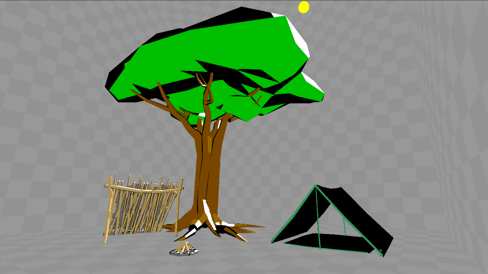
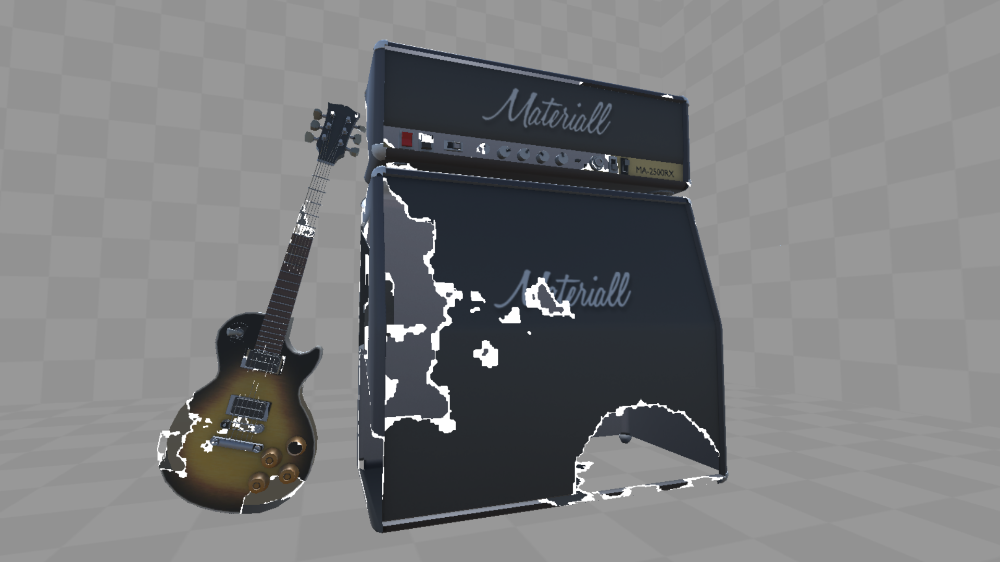
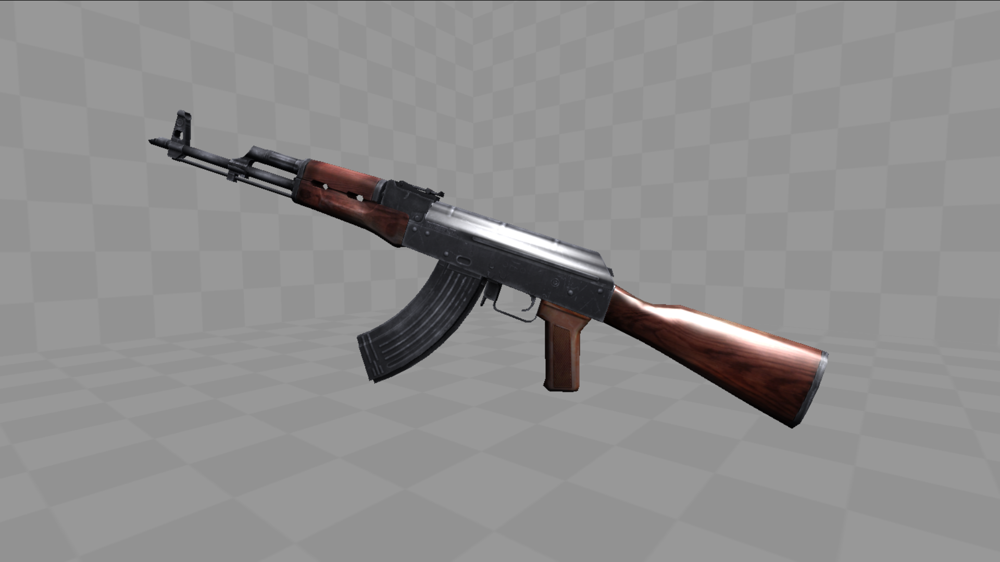

# Unity 3D Shader Demo

A demonstration of three different shader techniques using CG/HLSL in Unity 3D. The shaders used in this demo are a toon shader, a dissolve shader and a Phong shader. Hosted at https://peroshki.github.io/Unity-3D-Shader-Demo/

## Controls
| Key        | Action           |
| ------------- |:-------------:|
| Arrow Keys      | Walk |
| Space      | Jump      |
| Left Shift | Run      |

## Tips
* Look up towards the ceiling to see where the light source is!

## Screenshots

Toon shader

